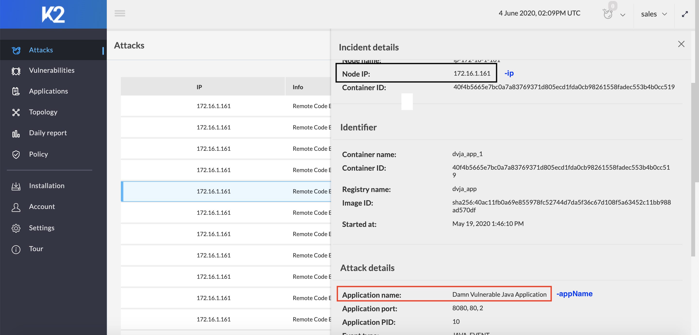

# K2-Report-Generator-API

This repository contains code to merge vulnerability scan report produced by DAST solution (e.g. Tenable) with the results K2 generates during those scans.

The executable JAR package will produce combined report.

This is an executable JAR package.

Build Jar using command:

```
mvn clean package
```

Use Case:

```
java -jar k2-report-generator-api.jar -dast "<vendor-name>" -outputDir "<output-dir-path-where-reports-will-extract>" -dastProperties "<path-to-dast-properties-file>" -k2Properties "<path-to-k2-properties-file>" -scanId "<scan-id>" -ip "<ip>" -appName "<web-application-name>"
```

**Note** : All parameters are mandatory

### Parameter information
-dast : vendor name (ex. tenable)

-outputDir : Final reports will be created in this repository, repository will be created if not present

-dastProperties : Update [dast.properties](dast.properties) file and provide full path of dast.properties file using this Parameter.

-k2Properties : Update [k2.properties](k2.properties) file and provide full path of k2.properties file using this Parameter.

-scanId : Numerical scan id number of the scan for which reports has to be processed.

-ip : Private IP of the machine on which scan has been run.

-appName : Web application name on which scan has ran.


### How to get ip?
Once the scan completes get the hostIp from any one of the incident for that scan from K2 Manager UI.(See screenshot)

### How to get appName?
Once the scan completes get the appName from any one of the incident for that scan from K2 Manager UI.(See screenshot)



### Sample dast.properties
```
tenableUrl=https://cloud.tenable.com
accessKey=
secretKey=
```
### How to get the DAST propperties for Tenable?
Login to tenable.io, Go to My Account -> API Keys and generate API keys.

### Sample k2.preoperties
```
k2Url=https://www.k2io.net/centralmanager
k2CustomerId=
k2CustomerEmail=
k2CustomerPassword=
```
### How to get the K2 properties?
Use k2io.com account, customerId and credentials in k2.properties.
